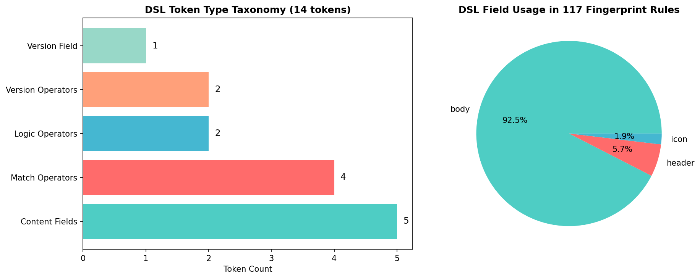
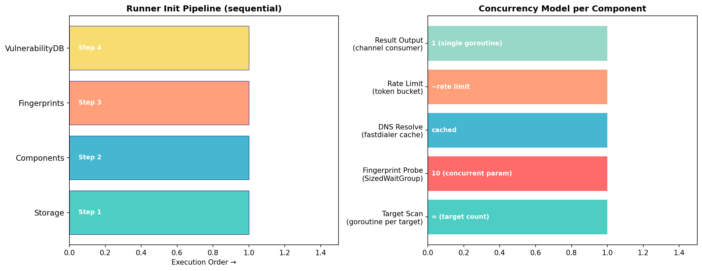
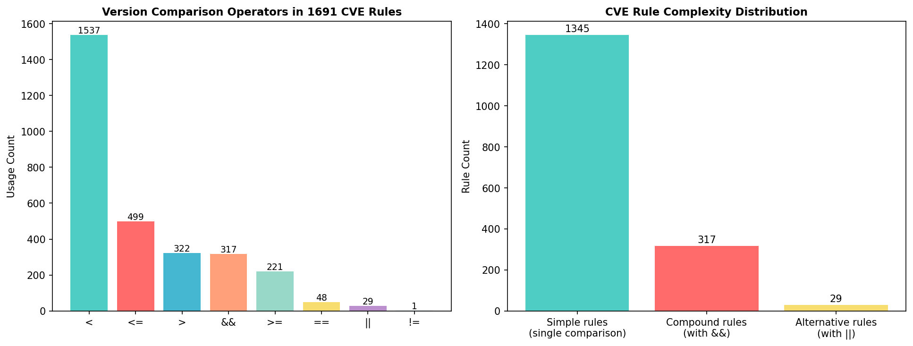
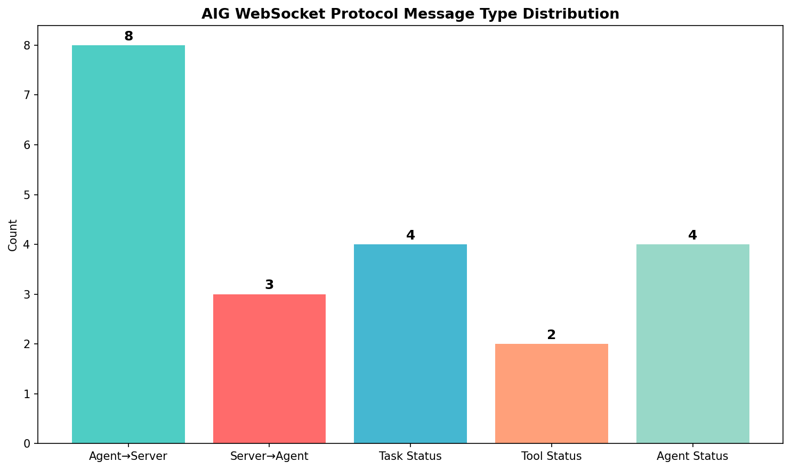
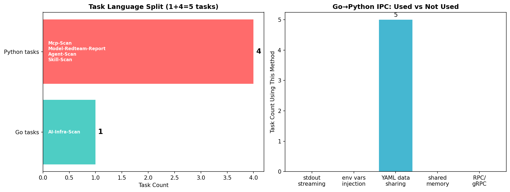
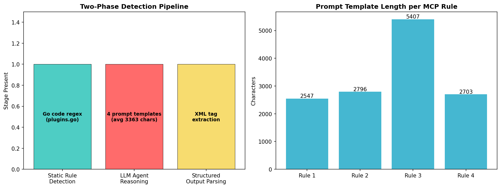
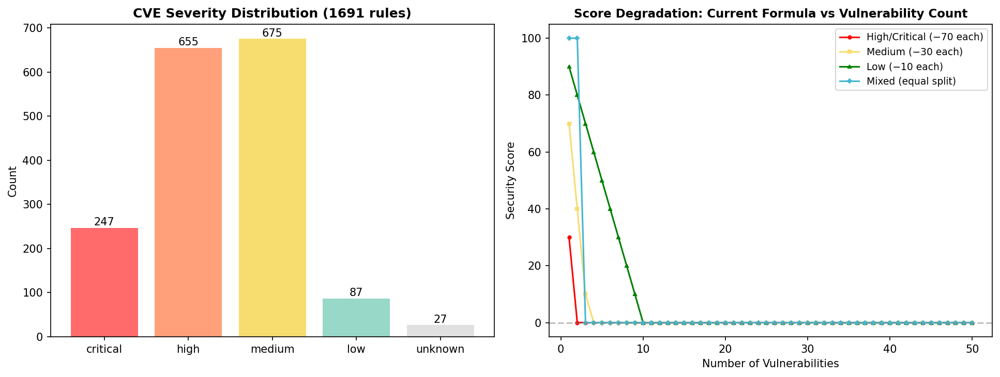
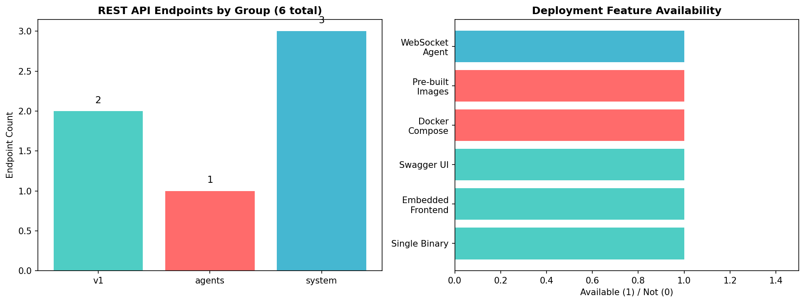

# AI-Infra-Guard 工程架构解析：AI 安全平台的设计模式与实现剖析

## 前言

AI-Infra-Guard（AIG）是腾讯朱雀实验室开源的 AI 红队安全扫描平台，在 GitHub 上获得超过 4000 Star。前序两篇技术文章分别从"数据提取"和"方法提取"的角度，展示了如何复用 AIG 的漏洞规则库、越狱评测数据集和攻防方法作为研究 baseline。本文切换视角，从**工程实现**的角度剖析 AIG 的架构设计——一个安全扫描平台如何组织代码、如何切分语言职责、如何设计规则引擎 DSL、如何编排分布式任务，这些工程决策本身构成了可复用的设计模式。

AIG 的技术栈是 Go + Python 混合架构：Go 负责高并发网络探测和 Web 平台，Python 负责 LLM agent 循环和评测框架。四类扫描任务（基础设施扫描、MCP 安全扫描、Agent 工作流扫描、越狱评测）通过分布式 Server-Agent 模型编排。所有检测规则以 YAML 文件形式版本控制，不嵌入编译产物。本文从 AIG 代码库中提取 8 个工程架构场景，每个场景分析一个核心设计决策，配套提供 Python 提取脚本，读者可以 `git clone` 后直接运行得到结构化分析结果。

本文配套代码位于 [AIG-Recipes](https://github.com/NY1024/AIG-Recipes) 仓库的 `mini-arch/` 目录下，包含 8 个提取脚本和对应的 JSON/CSV/PNG 输出文件。

## 目录结构

| 场景 | 分析对象 | 提取脚本 |
|------|---------|---------|
| [场景一：指纹规则引擎 DSL 设计](#场景一指纹规则引擎-dsl-设计) | `common/fingerprints/parser/` | [extract_dsl_grammar.py](https://github.com/NY1024/AIG-Recipes/blob/main/mini-arch/extract_dsl_grammar.py) |
| [场景二：并发扫描引擎架构](#场景二并发扫描引擎架构) | `common/runner/runner.go` | [extract_scan_engine.py](https://github.com/NY1024/AIG-Recipes/blob/main/mini-arch/extract_scan_engine.py) |
| [场景三：版本比较 DSL 与漏洞建议引擎](#场景三版本比较-dsl-与漏洞建议引擎) | `pkg/vulstruct/` + `version_range.go` | [extract_version_dsl.py](https://github.com/NY1024/AIG-Recipes/blob/main/mini-arch/extract_version_dsl.py) |
| [场景四：Server-Agent 分布式架构](#场景四server-agent-分布式架构) | `common/websocket/agent.go` + `common/agent/` | [extract_server_agent.py](https://github.com/NY1024/AIG-Recipes/blob/main/mini-arch/extract_server_agent.py) |
| [场景五：Go+Python 混合架构](#场景五gopython-混合架构) | `common/agent/tasks.go` | [extract_hybrid_arch.py](https://github.com/NY1024/AIG-Recipes/blob/main/mini-arch/extract_hybrid_arch.py) |
| [场景六：Rule-First + LLM-Augmented 分层协作](#场景六rule-first--llm-augmented-分层协作) | `internal/mcp/` | [extract_rule_llm_layered.py](https://github.com/NY1024/AIG-Recipes/blob/main/mini-arch/extract_rule_llm_layered.py) |
| [场景七：安全评分算法分析](#场景七安全评分算法分析) | `common/runner/runner.go` CalcSecScore | [extract_scoring_algorithm.py](https://github.com/NY1024/AIG-Recipes/blob/main/mini-arch/extract_scoring_algorithm.py) |
| [场景八：多部署形态架构](#场景八多部署形态架构) | `common/websocket/server.go` + Docker | [extract_deployment_profiles.py](https://github.com/NY1024/AIG-Recipes/blob/main/mini-arch/extract_deployment_profiles.py) |

## 配套代码

| 脚本 | 输入 | 输出 |
|------|------|------|
| extract_dsl_grammar.py | Go parser 源码 + 117 个指纹 YAML | dsl_grammar.json/csv/png |
| extract_scan_engine.py | runner.go + preload.go | scan_engine.json/csv/png |
| extract_version_dsl.py | advisory.go + version_range.go + 1691 条 CVE 规则 | version_dsl.json/csv/png |
| extract_server_agent.py | agent.go + types.go + sse_manager.go | server_agent.json/csv/png |
| extract_hybrid_arch.py | tasks.go + mcp_task.go 等 4 个任务文件 | hybrid_arch.json/csv/png |
| extract_rule_llm_layered.py | plugins.go + scanner.go + data/mcp/ | rule_llm_layered.json/csv/png |
| extract_scoring_algorithm.py | runner.go CalcSecScore + data/vuln/ | scoring_algorithm.json/csv/png |
| extract_data_source_of_truth.py | data/ 目录 + yamlcheck | data_source_of_truth.json/csv/png |
| extract_deployment_profiles.py | server.go + docker-compose.yml | deployment_profiles.json/csv/png |

---

## 场景一：指纹规则引擎 DSL 设计

### 研究背景

安全扫描工具的核心挑战之一是规则的可表达性：如何用简洁的语法定义"当 HTTP 响应体包含某字符串且头部匹配某正则时，判定为某组件"。传统方案要么用 JSON 硬编码匹配逻辑（不够灵活），要么用通用脚本语言（安全隐患大）。AIG 设计了一套自定义表达式 DSL，在 YAML 规则文件中用类自然语言语法描述匹配条件，由 Go 引擎编译为 AST 并求值。

### AIG 的 DSL 架构

AIG 的指纹 DSL 由三个文件实现，职责清晰分离：

- [token.go](https://github.com/Tencent/AI-Infra-Guard/blob/main/common/fingerprints/parser/token.go)：词法分析器，定义 14 种 token 类型
- [synax.go](https://github.com/Tencent/AI-Infra-Guard/blob/main/common/fingerprints/parser/synax.go)：语法分析器和 AST 求值器，定义 3 种 AST 节点
- [parser.go](https://github.com/Tencent/AI-Infra-Guard/blob/main/common/fingerprints/parser/parser.go)：YAML schema 和编译入口

**Token 类型体系**包含 6 类内容字段（`body`、`header`、`icon`、`hash`、`version`、`is_internal`）、4 类比较运算符（`=`包含、`==`精确匹配、`!=`不等于、`~=`正则匹配）、2 类逻辑运算符（`&&`、`||`）、6 类版本比较运算符（`>`、`>=`、`<`、`<=`、`==`、`!=`）以及括号。

**AST 节点类型**有三种：

- `dslExp`：原子比较表达式，如 `body == "Ollama"`
- `logicExp`：逻辑组合表达式，支持 AND/OR 短路求值
- `bracketExp`：括号表达式，控制优先级

**编译流水线**为：YAML 字符串 → `ParseTokens()`（词法分析）→ `CheckBalance()`（括号平衡校验）→ `TransFormExp()`（构建 AST）→ 运行时 `Eval()`（递归求值）。

### 代码剖析

词法分析器 `ParseTokens` 逐字符扫描输入字符串，按首字符分发到不同解析器：引号触发文本提取、运算符首字符触发运算符匹配、字母触发关键字匹配。这种手写 lexer 避免了引入 lexer 生成器的依赖。

语法分析采用递归下降：`parseExpr` 处理逻辑运算符（`&&`/`||`），`parsePrimaryExpr` 处理原子表达式和括号子表达式。值得注意的是括号表达式的优先级提升逻辑——当右侧操作数是 `bracketExp` 时，交换左右子树位置以提高括号优先级。

求值器 `Eval` 使用递归访问 AST，对 `dslExp` 节点按运算符执行对应操作（`strings.Contains`、`==`、正则 `MatchString`），对 `logicExp` 节点执行短路求值（AND 遇 false 即停、OR 遇 true 即停）。

一个值得关注的设计约束是 **hash matcher 隔离**：`compileMatchers` 函数检查每条 HttpRule 的所有 matcher，如果包含 hash 类型匹配器则不允许与其他类型匹配器共存。这是因为 hash 匹配基于响应体 SHA256 值，与内容匹配语义不同，混用会产生逻辑歧义。

### 已知局限

`versionCheck` 函数在版本比较前对版本字符串做标准化处理——去除所有字母字符。这意味着 `1.0.0-alpha` 会被标准化为 `1.0.0`，与正式版产生误匹配。虽然代码中先尝试将 `.alpha` 后缀替换为 `.0`，但最终仍会剥离所有字母，导致 `1.0.0-rc1` 变为 `1.0.0.01` 再变为 `1.0.001`。这是 AIG 版本比较精度的一个已知限制。

### 提炼的设计模式

**Rule-Engine DSL 模式**：将匹配规则从引擎代码中分离，用自定义 DSL 描述，编译为 AST 后求值。核心设计决策包括：词法/语法/语义分析三阶段分离、短路求值优化、hash matcher 类型隔离、两套 DSL 模式（指纹匹配 vs 版本比较）共用同一套 AST 基础设施。



---

## 场景二：并发扫描引擎架构

### 研究背景

AI 基础设施扫描需要同时探测大量目标（IP 段、域名列表），每个目标要发送多个 HTTP 请求进行指纹识别，再对识别到的组件执行 CVE 匹配。如何在保证扫描速度的同时控制资源消耗，是扫描引擎架构的核心问题。

### AIG 的扫描引擎设计

AIG 的扫描引擎位于 [runner.go](https://github.com/Tencent/AI-Infra-Guard/blob/main/common/runner/runner.go)，采用 Producer-Consumer + Channel 模式：

**初始化流水线**按顺序执行四个阶段：`initStorage`（初始化 HybridMap 混合存储）→ `initComponents`（速率限制器、DNS 解析器、HTTP 客户端）→ `initFingerprints`（加载 117 个 YAML 指纹并编译 DSL）→ `initVulnerabilityDB`（加载 1691 条 CVE 规则并编译版本比较 AST）。

**并发控制**使用 `sizedwaitgroup`（来自 projectdiscovery），并发度等于速率限制值，而非固定 worker 池。每个目标在独立 goroutine 中执行：HTTP/HTTPS 自动重试（先尝试 HTTP，失败后切换 HTTPS），成功后进入指纹识别阶段。

**指纹探测**在 [preload.go](https://github.com/Tencent/AI-Infra-Guard/blob/main/common/fingerprints/preload/preload.go) 中实现：对每个目标并发执行所有指纹规则，使用 `sizedwaitgroup.New(concurrent)` 控制并发度（默认 10），结果通过 `sync.Mutex` 保护写入。一个优化是**首页缓存**：所有 GET `/` 请求的指纹规则共享同一个 `indexCache` 响应，避免重复请求目标首页。

**结果流**通过 channel 传递：扫描 goroutine 将结果写入 `chan HttpResult`，独立的 `handleOutput` goroutine 从 channel 读取并格式化输出、写入文件、触发回调。

**进度报告**通过原子计数器 `atomic.AddUint64` 跟踪已完成目标数，通过回调函数 `callbackProcess` 向上层（CLI 或 Web 平台）报告进度。

### 设计决策分析

| 组件 | 选型 | 理由 |
|------|------|------|
| 并发控制 | SizedWaitGroup | 轻量级，无需管理 worker pool 生命周期 |
| 目标存储 | HybridMap (disk+memory) | 处理大目标列表不 OOM |
| 速率限制 | go.uber.org/ratelimit | token bucket，平滑请求速率 |
| DNS 解析 | fastdialer | 缓存 DNS 结果，减少解析延迟 |
| 结果传递 | Channel | 解耦生产者和消费者 |
| 协议探测 | HTTP→HTTPS 自动重试 | 兼容性优先，goto label 实现 |

**指纹去重**使用 O(n²) 嵌套循环——遍历结果切片查找同名指纹，找到则替换。当指纹数量较大时这是性能瓶颈，可以用 map 优化到 O(n)。

**安全评分** `CalcSecScore` 采用绝对扣分制：基础分 100，每个 Critical/High 扣 70 分、Medium 扣 30 分、Low 扣 10 分，扣到 0 为止。当完整加载 1691 条漏洞规则时，模拟评分结果为 0——说明该算法在大量漏洞场景下区分度不足（详见场景七）。



---

## 场景三：版本比较 DSL 与漏洞建议引擎

### 研究背景

指纹识别确定组件名称和版本后，下一步是匹配 CVE 漏洞规则。漏洞规则的版本范围表达需要支持区间、比较运算符和逻辑组合，同时要处理版本号格式多样性（`v1.0.0`、`1.0.0-beta`、`latest`）。

### AIG 的版本比较体系

AIG 的漏洞建议引擎位于 [pkg/vulstruct/](https://github.com/Tencent/AI-Infra-Guard/blob/main/pkg/vulstruct/)，核心由三部分组成：

**VersionVul 结构体**通过自定义 `UnmarshalYAML` 方法在 YAML 反序列化时即时编译规则字符串为 AST。`Rule` 字段是 YAML 中的字符串，`RuleCompile` 是编译后的 `*parser.Rule`（不序列化）。这种"加载时编译"策略避免了每次查询时的重复解析开销。

**AdvisoryEngine** 以扁平 slice 存储所有漏洞规则，查询时线性扫描匹配 `FingerPrintName`，再对匹配项执行 `AdvisoryEval` 版本比较。没有索引或 hash map，简单但 O(n) 复杂度。

**版本区间运算**在 [version_range.go](https://github.com/Tencent/AI-Infra-Guard/blob/main/common/fingerprints/preload/version_range.go) 中实现，支持两种语法：

- 比较运算符语法：`>=1.0.0, <2.0.0`
- 区间语法：`[1.0.0, 2.0.0)`（左闭右开）

`versionRange` 结构体维护 `min`/`max` 两个边界和对应的 inclusive 标志。`applyLowerBound` 取两个下界中更高的一个，`applyUpperBound` 取两个上界中更低的一个，`intersectVersionRanges` 对多条模糊版本范围求交集——用于指纹规则中多条 version 规则的叠加约束。

### 实际规则统计

对 `data/vuln/` 目录下 1691 条中文 CVE 规则的分析显示，全部 1691 条规则都包含版本比较规则（`rule` 字段非空），支持 `>=`、`>`、`<=`、`<`、`==`、`=` 六种运算符。

### 已知局限

`versionCheck` 标准化函数会剥离所有字母字符，导致 `1.0.0-alpha` 与 `1.0.0` 被视为相同版本。这意味着预发布版本不会被正确区分——一个标记为 `<=1.0.0-alpha` 的漏洞规则会错误匹配 `1.0.0` 正式版。此外 `AdvisoryEngine` 的线性扫描在规则量增大时（当前 1691 条）查询效率会下降，可以考虑按组件名建立索引。



---

## 场景四：Server-Agent 分布式架构

### 研究背景

AIG 的四类扫描任务中，基础设施扫描（指纹+CVE）在 Go 进程内完成，但 MCP 代码审计、Agent 工作流测试、越狱评测需要调用 Python 子进程或 LLM API。如何将任务分发到多个执行节点、如何实时推送进度、如何处理节点故障，是分布式架构要解决的问题。

### AIG 的 Server-Agent 模型

AIG 采用 WebSocket 长连接的 Server-Agent 模型，由三套通信协议组成：

**WebSocket 协议**（Agent ↔ Server）定义了 21 种消息类型：

- Agent→Server：8 种，包括 `register`（注册）、`resultUpdate`（结果更新）、`actionLog`（插件日志）、`toolUsed`（工具状态）、`newPlanStep`（新建步骤）、`statusUpdate`（状态更新）、`planUpdate`（计划更新）、`error`（错误）
- Server→Agent：3 种，包括 `register_ack`（注册响应）、`task_assign`（任务分配）、`terminate`（终止任务）
- 任务状态：4 种（pending → running → complete/failed）
- 工具状态：2 种（doing/done）
- Agent 状态：4 种（idle/running/completed/failed）

**双锁设计**：[AgentConnection](https://github.com/Tencent/AI-Infra-Guard/blob/main/common/websocket/agent.go) 使用两把锁——`stateMu`（RWMutex）保护连接状态（agentID、isActive），`writeMu`（Mutex）保护 WebSocket 写操作。读写分离锁允许多个 goroutine 并发读取状态，写操作串行化避免 WebSocket 帧交错。

**心跳机制**：Server 端每 ~96 秒发送 ping，Agent 端 pong 响应更新读超时为 120 秒。心跳失败后重试一次（1 秒等待），二次失败标记连接失效。Agent 端的 pong handler 更新 read deadline 保持连接活跃。

**SSE 推送**：[sse_manager.go](https://github.com/Tencent/AI-Infra-Guard/blob/main/common/websocket/sse_manager.go) 为前端提供 Server-Sent Events 通道，每 10 秒发送 `liveStatus` 心跳（文本"思考中..."），收到 Agent 事件后通过 SSE 实时转发给前端。同一 sessionId 的新连接会关闭旧连接。

### 任务执行模型

Agent 端收到 `task_assign` 消息后，为每个任务创建独立的 goroutine 和 `context.CancelFunc`。任务执行过程中通过 6 种回调函数向 Server 流式推送进度：

- `ResultCallback`：最终结果
- `ToolUseLogCallback`：工具调用日志
- `ToolUsedCallback`：工具工作状态
- `NewPlanStepCallback`：新建执行步骤
- `StepStatusUpdateCallback`：步骤状态更新
- `PlanUpdateCallback`：整体计划更新

所有回调通过 `sendChan`（缓冲 100 的 channel）序列化发送，避免并发写入 WebSocket。

### 设计决策

Agent 注册时使用 `go-playground/validator` 验证必填字段（agent_id、hostname、ip、version），提供结构化错误信息。相同 agent_id 注册时自动关闭旧连接——不支持任务迁移，旧连接上的运行中任务会因 context cancel 而终止。



---

## 场景五：Go+Python 混合架构

### 研究背景

AIG 需要同时处理高并发网络探测（Go 的优势）和 LLM agent 推理循环（Python 生态的优势）。将两种语言混合在一个系统中，如何切分职责边界、如何跨语言通信、如何管理 Python 依赖，是混合架构设计的核心问题。

### AIG 的语言职责切分

AIG 定义了 7 种任务类型，按语言分为两类：

**Go 原生任务**（1 种）：
- `AI-Infra-Scan`：基础设施扫描，直接调用 `Runner.RunEnumeration()`，无子进程开销

**Python 子进程任务**（4 种）：
- `Mcp-Scan`：MCP 安全扫描，通过 `exec.Command` 调用 `python mcp-scan/main.py`
- `Model-Redteam-Report`：越狱评测，通过 `uv run AIG-PromptSecurity/cli_run.py`
- `Agent-Scan`：Agent 工作流测试，通过 `python agent-scan/main.py`
- `Skill-Scan`：Skill 安全扫描，通过 Python 子进程

### 跨语言通信机制

Go 和 Python 之间**不共享内存、不使用 RPC**，通信完全通过进程边界：

- **子进程调用**：Go 用 `exec.Command` 启动 Python 进程，通过 `StdoutPipe`/`StderrPipe` 捕获输出
- **流式输出**：`tmpWriter` 封装 Python stdout，按行分割后通过 callback 流式推送给前端
- **环境变量注入**：Python 子进程通过 `os.Setenv` 或 `cmd.Env` 接收配置（模型 API Key、目标 URL 等）
- **YAML 数据共享**：`data/` 目录下的 YAML 规则文件是 Go 和 Python 的共同契约——Go 引擎和 Python agent 读取相同格式的规则文件

### Python 子项目管理

每个 Python 子项目有独立的虚拟环境：`AIG-PromptSecurity` 使用 `uv` 管理（`uv run`），`mcp-scan` 和 `agent-scan` 使用传统 `pip install -r requirements.txt`。这种隔离避免了依赖冲突，但增加了部署复杂度。

### 设计模式提炼

**Language Split by Concern 模式**：按语言优势切分职责——Go 做 I/O 密集型（网络探测、WebSocket 服务、任务调度），Python 做 LLM 交互（代码审计、越狱评测、Agent 模拟）。两种语言通过进程边界 + YAML 数据文件解耦，不引入跨语言调用框架。



---

## 场景六：Rule-First + LLM-Augmented 分层协作

### 研究背景

纯规则扫描速度快但覆盖面有限（只能检测预定义模式），纯 LLM 推理灵活但成本高且结果不稳定。如何将两者的优势结合，是 AI 安全检测工具的设计难题。

### AIG 的两阶段检测流水线

AIG 的 MCP 安全扫描采用 **Rule-First + LLM-Augmented** 分层设计：

**阶段一：静态规则检测**。[plugins.go](https://github.com/Tencent/AI-Infra-Guard/blob/main/internal/mcp/plugins.go) 定义了 `PluginConfig` YAML schema，每条 MCP 安全规则包含：
- LLM 提示词模板（`prompt_template` 字段）：指导 LLM 对代码做深度推理
- 静态检测逻辑在 Go 代码中实现（`plugins.go` 的 `Rule` struct），不嵌入 YAML

对 `data/mcp/` 目录下 4 条 MCP YAML 规则的分析显示，每条规则都包含 `prompt_template`，平均 prompt 长度约 3363 字符（最短 2547，最长 5407）。

**阶段二：LLM Agent 推理**。[scanner.go](https://github.com/Tencent/AI-Infra-Guard/blob/main/internal/mcp/scanner.go) 的 Scanner 接收静态规则匹配结果 + MCP Server 代码结构作为输入，调用 LLM agent 进行多轮推理。Scanner 支持四种输入类型：command（本地命令启动）、SSE（SSE 链接）、stream（Streamable HTTP）、code（代码路径直接审计）。

**阶段三：结构化输出解析**。LLM 输出使用 XML 风格标签格式：

```xml
<result>
  <title>漏洞名称</title>
  <desc>详细描述（含代码路径、技术分析）</desc>
  <level>critical/high/medium/low</level>
  <risk_type>风险类型</risk_type>
  <suggestion>修复建议</suggestion>
</result>
```

`ParseIssues` 函数用正则表达式提取各字段。选择 XML 标签而非 JSON 的原因是 LLM 生成 XML 标签比生成严格 JSON 更可靠——标签嵌套容错性更强。

### 设计决策分析

**prompt_template 下放给规则作者**：每条 MCP 安全规则的 LLM 提示词由规则作者在 YAML 中定义，而非在代码中硬编码。这意味着不同威胁类型可以定制不同的推理策略——SSRF 规则的 prompt 关注网络请求目标，反序列化规则的 prompt 关注 `pickle.loads` 调用链。

**SummaryResult 作为严重性把关**：最终的 `SummaryResult` prompt 要求 LLM 只返回 critical/high/medium 级别的漏洞，过滤掉 low 和误报。LLM 在这里扮演"严重性仲裁者"的角色。

**SummaryReport 处理阴性结果**：当 LLM 推理后未发现漏洞，`SummaryReport` 生成一份"为何未发现漏洞"的技术分析报告，包括扫描范围、可能原因和后续建议。这种优雅的阴性结果处理避免了用户面对空白报告的困惑。

### 提炼的设计模式

**Two-Phase Detection 模式**：Phase 1 用确定性规则（正则匹配）做快速初筛，Phase 2 用 LLM agent 对初筛结果做深度推理验证。规则保速度和一致性，LLM 保灵活性和覆盖面。prompt 模板下放给规则作者，实现"一规则一推理策略"。



---

## 场景七：安全评分算法分析

### 研究背景

安全扫描工具需要一个量化评分来直观反映目标的安全状况。评分算法的设计直接影响用户体验——太粗糙则区分度不足，太复杂则难以理解。

### AIG 的 CalcSecScore 实现

[runner.go](https://github.com/Tencent/AI-Infra-Guard/blob/main/common/runner/runner.go) 中的 `CalcSecScore` 采用**绝对扣分制**：

```
基础分 = 100
扣分 = Critical×70 + High×70 + Medium×30 + Low×10
安全分 = max(0, 100 - 扣分)
```

严重度分类通过字符串匹配实现：`"high"`、`"critical"`、`"高危"`、`"严重"` 归为 high 类，`"medium"`、`"中危"` 归为 medium 类，其余归为 low 类。

### 局限性分析

对 `data/vuln/` 目录下 1691 条 CVE 规则的严重度分布进行统计：Critical 247 条、High 655 条、Medium 675 条、Low 87 条。用当前公式模拟评分结果为 0——因为 247×70 + 655×70 = 63140，远超 100 分上限。

核心问题在于：当漏洞数量足够多时（1691 条中约 53% 为 High/Critical），固定扣分制的总分会迅速触底为 0，失去区分能力。一个有 2 条 High 漏洞的目标（扣 140 分→评分 0）和一个有 500 条 High 漏洞的目标，在当前算法下评分相同（都是 0）。评分退化曲线表明，仅需 2 个 High 漏洞或 4 个 Medium 漏洞即可将评分归零。

此外，算法**不集成 CVSS 分数**——CVSS 9.8 的 Critical 漏洞和 CVSS 7.0 的 High 漏洞扣同样的 70 分；**不区分暴露面**——仅内网可达的漏洞和公网可利用的漏洞权重相同；**无单漏洞上限**——4 个 Medium 漏洞扣 120 分（超过满分）直接 floor 到 0。

### 改进方向

1. 将 CVSS 分数纳入扣分计算：`deduction = f(cvss_score)` 而非固定值
2. 使用对数或平方根缩放多个漏洞的累计扣分，避免过早触底
3. 加入暴露面上下文：内网漏洞权重低于公网漏洞
4. 按行业基线做百分位标准化评分



---

## 场景八：多部署形态架构

### 研究背景

安全工具的使用场景多样：个人开发者偏好 CLI 一键扫描，企业团队需要 Web 平台协作，CI/CD 流水线需要 API 集成。同一套代码如何适配多种部署形态，是交付架构设计的挑战。

### AIG 的四种部署形态

**形态一：单二进制 CLI 模式**。`go build -o ai-infra-guard ./cmd/cli/main.go` 编译为单个二进制文件，直接执行 `./ai-infra-guard scan -t http://target:8088` 进行扫描。无需 Docker、无需数据库、无需 Web 服务器。

**形态二：Docker Compose 源码构建模式**。[docker-compose.yml](https://github.com/Tencent/AI-Infra-Guard/blob/main/docker-compose.yml) 从源码构建镜像，适合开发环境。

**形态三：Docker Compose 预构建镜像模式**。[docker-compose.images.yml](https://github.com/Tencent/AI-Infra-Guard/blob/main/docker-compose.images.yml) 使用预构建镜像，适合生产部署。包含 3 个服务（主服务 + Python 子项目 + 数据库）。

**形态四：API-Only 集成模式**。通过 `/api/v1/app/taskapi/` 端点组提供第三方 API（创建任务、查询状态、获取结果），无需 WebUI 即可集成到 CI/CD 流水线。

### 前端嵌入设计

[server.go](https://github.com/Tencent/AI-Infra-Guard/blob/main/common/websocket/server.go) 使用 `//go:embed static/*` 将编译后的 SPA 前端（React/Vue 产物）嵌入 Go 二进制。`NoRoute` 处理器将所有未匹配的路径回退到 `static/index.html`，实现 SPA 路由。同时嵌入 Swagger UI（`/docs/`）提供 API 文档。

### API 结构

REST API 在 `/api/v1/` 下分为 6 个端点组：

- `knowledge/`：知识库管理（指纹、漏洞、评测集、MCP 规则、Prompt 集合、Agent 配置）
- `app/tasks/`：任务管理（创建、查询、SSE 进度、终止）
- `app/models/`：模型管理（LLM API 配置）
- `agents/ws`：Agent WebSocket 入口
- `app/taskapi/`：第三方 API
- `system/`：系统管理（数据更新、版本检查）

### 环境变量配置

无需配置文件，全部通过环境变量控制：`DB_PATH`（数据库路径）、`UPLOAD_DIR`（上传目录）、`AIG_SERVER`（Agent 连接地址）、`APP_ENV`（生产/开发模式）、`TZ`（时区）。

### 提炼的设计模式

**Multi-Profile Delivery 模式**：一套代码、四种交付形态——单二进制（CLI）↔ Docker Compose（平台）↔ API-Only（集成）↔ 嵌入式前端（WebUI）。通过 `go:embed` 将前端打包进二进制消除"前端单独部署"的需求，通过环境变量消除配置文件依赖，通过 API 端点分组实现"WebUI 用户"和"API 用户"的不同入口。



---

## 总结：八种设计模式的整体视图

| 场景 | 设计模式 | 核心决策 |
|------|---------|---------|
| 指纹 DSL | Rule-Engine DSL | 自定义表达式语言，词法/语法/求值三阶段分离 |
| 并发引擎 | Producer-Consumer + Channel | SizedWaitGroup 并发 + HybridMap 存储 + 原子计数器 |
| 版本比较 | Compiled Rule DSL | 加载时编译 AST + 区间运算 + 模糊版本交集 |
| 分布式架构 | Distributed Task Queue | WebSocket 长连接 + 双锁 + 6 种流式回调 |
| 混合架构 | Language Split by Concern | Go 做 I/O，Python 做 LLM，进程边界 + YAML 解耦 |
| 规则+LLM | Two-Phase Detection | 规则初筛 + LLM 深度推理 + XML 标签输出解析 |
| 评分算法 | Absolute Deduction | 固定扣分制，已知粗糙但有改进方向 |
| 多部署 | Multi-Profile Delivery | 单二进制 + go:embed + 环境变量 + API 分组 |

这八种设计模式并非孤立存在，而是相互支撑：DSL 模式支撑了"数据即真相"（规则用 YAML 描述），混合架构决定了"Go+Python 进程边界"（YAML 是跨语言契约），分布式架构实现了"多任务并行编排"（WebSocket 协议设计），Rule-First+LLM 体现了"确定性+不确定性"的分层协作。

对于安全工具开发者和系统架构师，AIG 的代码库提供了一个完整的参考实现：从 DSL 设计到并发引擎、从分布式协议到混合语言编排、从规则-LLM 协作到多部署形态——每个模块都可以独立提取和复用。

## 引用 AIG

如果在研究中使用了 AI-Infra-Guard，请引用：

```bibtex
@article{yang2026securing,
  title={Securing the AI Agent: A Unified Framework for Multi-Layer Agent Red Teaming},
  author={Yang, Yong and Zheng, Xing and Wu, Huiyu and Cheng, Huangsheng and Shi, Xiaorong and Guo, Jing and Yang, Bo and Zhou, Yi and Wu, Xiangfan and Ying, Zonghao},
  journal={arXiv preprint arXiv:2606.31227},
  year={2026}
}
```
