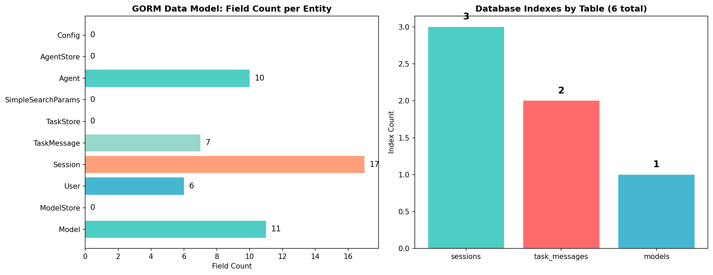
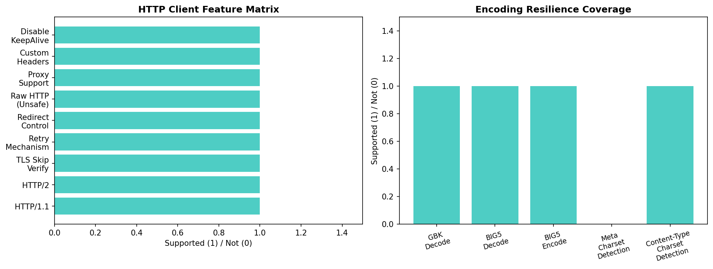
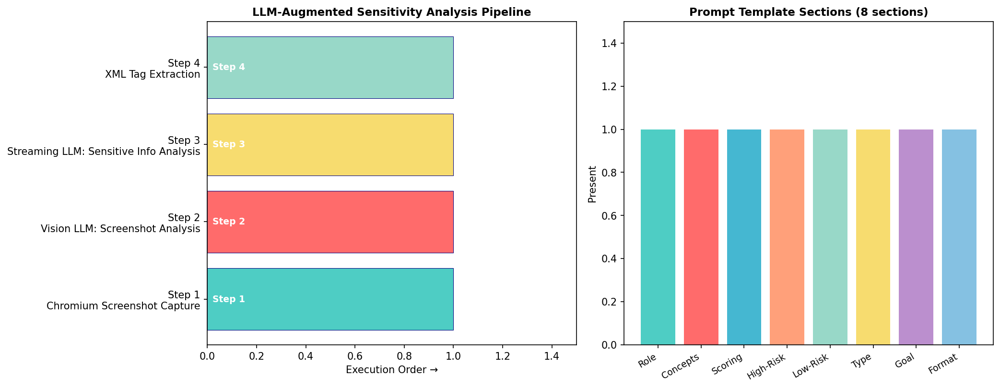
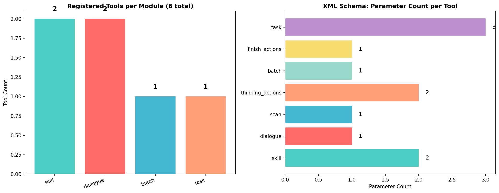
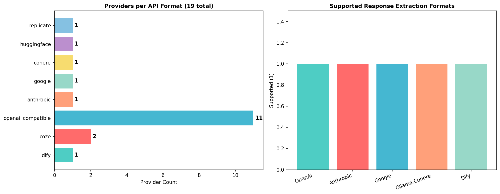
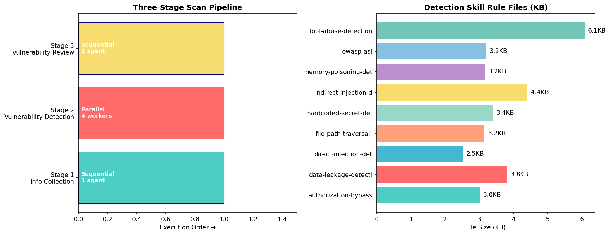

# AI-Infra-Guard 工程架构解析：AI 安全平台的设计模式与实现剖析

## 前言

AI-Infra-Guard（AIG）是腾讯朱雀实验室开源的 AI 红队安全扫描平台，在 GitHub 上获得超过 4000 Star。前序两篇技术文章分别从"数据提取"和"方法提取"的角度，展示了如何复用 AIG 的漏洞规则库、越狱评测数据集和攻防方法作为研究 baseline。本文切换视角，从**工程实现**的角度剖析 AIG 的架构设计——一个安全扫描平台如何组织代码、如何切分语言职责、如何设计规则引擎 DSL、如何编排分布式任务，这些工程决策本身构成了可复用的设计模式。

AIG 的技术栈是 Go + Python 混合架构：Go 负责高并发网络探测和 Web 平台，Python 负责 LLM agent 循环和评测框架。四类扫描任务（基础设施扫描、MCP 安全扫描、Agent 工作流扫描、越狱评测）通过分布式 Server-Agent 模型编排。所有检测规则以 YAML 文件形式版本控制，不嵌入编译产物。本文从 AIG 代码库中提取 8 个工程架构场景，每个场景分析一个核心设计决策，配套提供 Python 提取脚本，读者可以 `git clone` 后直接运行得到结构化分析结果。

本文配套代码位于 [AIG-Recipes](https://github.com/NY1024/AIG-Recipes) 仓库的 `mini-arch/` 目录下，包含 14 个提取脚本和对应的 JSON/CSV/PNG 输出文件。

## 目录结构

| 场景 | 分析对象 | 提取脚本 |
|------|---------|---------|
| [场景一：指纹规则引擎 DSL 设计](#场景一指纹规则引擎-dsl-设计) | `common/fingerprints/parser/` | [extract_dsl_grammar.py](https://github.com/NY1024/AIG-Recipes/blob/main/mini-arch/extract_dsl_grammar.py) |
| [场景二：并发扫描引擎架构](#场景二并发扫描引擎架构) | `common/runner/runner.go` | [extract_scan_engine.py](https://github.com/NY1024/AIG-Recipes/blob/main/mini-arch/extract_scan_engine.py) |
| [场景三：版本比较 DSL 与漏洞建议引擎](#场景三版本比较-dsl-与漏洞建议引擎) | `pkg/vulstruct/` + `version_range.go` | [extract_version_dsl.py](https://github.com/NY1024/AIG-Recipes/blob/main/mini-arch/extract_version_dsl.py) |
| [场景四：Server-Agent 分布式架构](#场景四server-agent-分布式架构) | `common/websocket/agent.go` + `common/agent/` | [extract_server_agent.py](https://github.com/NY1024/AIG-Recipes/blob/main/mini-arch/extract_server_agent.py) |
| [场景五：Go+Python 混合架构](#场景五gopython-混合架构) | `common/agent/tasks.go` | [extract_hybrid_arch.py](https://github.com/NY1024/AIG-Recipes/blob/main/mini-arch/extract_hybrid_arch.py) |
| [场景六：Rule-First + LLM-Augmented 分层协作](#场景六rule-first--llm-augmented-分层协作) | `internal/mcp/` | [extract_rule_llm_layered.py](https://github.com/NY1024/AIG-Recipes/blob/main/mini-arch/extract_rule_llm_layered.py) |
| [场景七：安全评分算法分析](#场景七安全评分算法分析) | `common/runner/runner.go` CalcSecScore | [extract_scoring_algorithm.py](https://github.com/NY1024/AIG-Recipes/blob/main/mini-arch/extract_scoring_algorithm.py) |
| [场景八：多部署形态架构](#场景八多部署形态架构) | `common/websocket/server.go` + Docker | [extract_deployment_profiles.py](https://github.com/NY1024/AIG-Recipes/blob/main/mini-arch/extract_deployment_profiles.py) |
| [场景九：数据库持久化与任务状态机](#场景九数据库持久化与任务状态机) | `pkg/database/` | [extract_database_persistence.py](https://github.com/NY1024/AIG-Recipes/blob/main/mini-arch/extract_database_persistence.py) |
| [场景十：HTTP 探测引擎与编码韧性](#场景十http-探测引擎与编码韧性) | `pkg/httpx/` | [extract_http_probing.py](https://github.com/NY1024/AIG-Recipes/blob/main/mini-arch/extract_http_probing.py) |
| [场景十一：LLM 增强敏感信息检测](#场景十一llm-增强敏感信息检测) | `common/runner/ai.go` | [extract_llm_integration.py](https://github.com/NY1024/AIG-Recipes/blob/main/mini-arch/extract_llm_integration.py) |
| [场景十二：Agent 工具系统与 XML Schema 注册](#场景十二agent-工具系统与-xml-schema-注册) | `agent-scan/tools/` | [extract_tool_system.py](https://github.com/NY1024/AIG-Recipes/blob/main/mini-arch/extract_tool_system.py) |
| [场景十三：多平台 Provider 适配与连接韧性](#场景十三多平台-provider-适配与连接韧性) | `agent-scan/core/agent_adapter/` | [extract_provider_adapter.py](https://github.com/NY1024/AIG-Recipes/blob/main/mini-arch/extract_provider_adapter.py) |
| [场景十四：三阶段 Agent 扫描流水线](#场景十四三阶段-agent-扫描流水线) | `agent-scan/core/agent.py` | [extract_scan_pipeline.py](https://github.com/NY1024/AIG-Recipes/blob/main/mini-arch/extract_scan_pipeline.py) |

## 配套代码

| 脚本 | 输入 | 输出 |
|------|------|------|
| extract_dsl_grammar.py | Go parser 源码 + 117 个指纹 YAML | dsl_grammar.json/csv/png |
| extract_scan_engine.py | runner.go + preload.go | scan_engine.json/csv/png |
| extract_version_dsl.py | advisory.go + version_range.go + 1691 条 CVE 规则 | version_dsl.json/csv/png |
| extract_server_agent.py | agent.go + types.go + sse_manager.go | server_agent.json/csv/png |
| extract_hybrid_arch.py | tasks.go + mcp_task.go 等 4 个任务文件 | hybrid_arch.json/csv/png |
| extract_rule_llm_layered.py | plugins.go + scanner.go + data/mcp/ | rule_llm_layered.json/csv/png |
| extract_scoring_algorithm.py | runner.go CalcSecScore + data/vuln/ | scoring_algorithm.json/csv/png |
| extract_data_source_of_truth.py | data/ 目录 + yamlcheck | data_source_of_truth.json/csv/png |
| extract_deployment_profiles.py | server.go + docker-compose.yml | deployment_profiles.json/csv/png |
| extract_database_persistence.py | pkg/database/ 4 个 Go 文件 | database_persistence.json/csv/png |
| extract_http_probing.py | pkg/httpx/ 7 个 Go 文件 | http_probing.json/csv/png |
| extract_llm_integration.py | runner/ai.go + utils/models/ | llm_integration.json/csv/png |
| extract_tool_system.py | agent-scan/tools/ 全目录 | tool_system.json/csv/png |
| extract_provider_adapter.py | agent_adapter/adapter.py + providers.yaml | provider_adapter.json/csv/png |
| extract_scan_pipeline.py | core/agent.py + prompt/skills/ | scan_pipeline.json/csv/png |

---

## 场景一：指纹规则引擎 DSL 设计

### 研究背景

安全扫描工具的核心挑战之一是规则的可表达性：如何用简洁的语法定义"当 HTTP 响应体包含某字符串且头部匹配某正则时，判定为某组件"。传统方案要么用 JSON 硬编码匹配逻辑（不够灵活），要么用通用脚本语言（安全隐患大）。AIG 设计了一套自定义表达式 DSL，在 YAML 规则文件中用类自然语言语法描述匹配条件，由 Go 引擎编译为 AST 并求值。

### AIG 的 DSL 架构

AIG 的指纹 DSL 由三个文件实现，职责清晰分离：

- [token.go](https://github.com/Tencent/AI-Infra-Guard/blob/main/common/fingerprints/parser/token.go)：词法分析器，定义 14 种 token 类型
- [synax.go](https://github.com/Tencent/AI-Infra-Guard/blob/main/common/fingerprints/parser/synax.go)：语法分析器和 AST 求值器，定义 3 种 AST 节点
- [parser.go](https://github.com/Tencent/AI-Infra-Guard/blob/main/common/fingerprints/parser/parser.go)：YAML schema 和编译入口

**Token 类型体系**包含 6 类内容字段（`body`、`header`、`icon`、`hash`、`version`、`is_internal`）、4 类比较运算符（`=`包含、`==`精确匹配、`!=`不等于、`~=`正则匹配）、2 类逻辑运算符（`&&`、`||`）、6 类版本比较运算符（`>`、`>=`、`<`、`<=`、`==`、`!=`）以及括号。

**AST 节点类型**有三种：

- `dslExp`：原子比较表达式，如 `body == "Ollama"`
- `logicExp`：逻辑组合表达式，支持 AND/OR 短路求值
- `bracketExp`：括号表达式，控制优先级

**编译流水线**为：YAML 字符串 → `ParseTokens()`（词法分析）→ `CheckBalance()`（括号平衡校验）→ `TransFormExp()`（构建 AST）→ 运行时 `Eval()`（递归求值）。

### 代码剖析

词法分析器 `ParseTokens` 逐字符扫描输入字符串，按首字符分发到不同解析器：引号触发文本提取、运算符首字符触发运算符匹配、字母触发关键字匹配。这种手写 lexer 避免了引入 lexer 生成器的依赖。

语法分析采用递归下降：`parseExpr` 处理逻辑运算符（`&&`/`||`），`parsePrimaryExpr` 处理原子表达式和括号子表达式。值得注意的是括号表达式的优先级提升逻辑——当右侧操作数是 `bracketExp` 时，交换左右子树位置以提高括号优先级。

求值器 `Eval` 使用递归访问 AST，对 `dslExp` 节点按运算符执行对应操作（`strings.Contains`、`==`、正则 `MatchString`），对 `logicExp` 节点执行短路求值（AND 遇 false 即停、OR 遇 true 即停）。

一个值得关注的设计约束是 **hash matcher 隔离**：`compileMatchers` 函数检查每条 HttpRule 的所有 matcher，如果包含 hash 类型匹配器则不允许与其他类型匹配器共存。这是因为 hash 匹配基于响应体 SHA256 值，与内容匹配语义不同，混用会产生逻辑歧义。

### 设计权衡

`versionCheck` 函数在版本比较前对版本字符串做标准化处理——去除所有字母字符。这是一个有意的设计简化：安全扫描场景中，绝大多数目标运行的是正式版本而非预发布版本，将 `1.0.0-alpha` 统一映射到 `1.0.0` 可以保证正式版规则覆盖预发布版本，避免遗漏。代码中先将 `.alpha` 后缀替换为 `.0` 再做最终标准化，体现了对预发布版本的渐进式处理思路。

### 提炼的设计模式

**Rule-Engine DSL 模式**：将匹配规则从引擎代码中分离，用自定义 DSL 描述，编译为 AST 后求值。核心设计决策包括：词法/语法/语义分析三阶段分离、短路求值优化、hash matcher 类型隔离、两套 DSL 模式（指纹匹配 vs 版本比较）共用同一套 AST 基础设施。


---

## 场景二：并发扫描引擎架构

### 研究背景

AI 基础设施扫描需要同时探测大量目标（IP 段、域名列表），每个目标要发送多个 HTTP 请求进行指纹识别，再对识别到的组件执行 CVE 匹配。如何在保证扫描速度的同时控制资源消耗，是扫描引擎架构的核心问题。

### AIG 的扫描引擎设计

AIG 的扫描引擎位于 [runner.go](https://github.com/Tencent/AI-Infra-Guard/blob/main/common/runner/runner.go)，采用 Producer-Consumer + Channel 模式：

**初始化流水线**按顺序执行四个阶段：`initStorage`（初始化 HybridMap 混合存储）→ `initComponents`（速率限制器、DNS 解析器、HTTP 客户端）→ `initFingerprints`（加载 117 个 YAML 指纹并编译 DSL）→ `initVulnerabilityDB`（加载 1691 条 CVE 规则并编译版本比较 AST）。

**并发控制**使用 `sizedwaitgroup`（来自 projectdiscovery），并发度等于速率限制值，而非固定 worker 池。每个目标在独立 goroutine 中执行：HTTP/HTTPS 自动重试（先尝试 HTTP，失败后切换 HTTPS），成功后进入指纹识别阶段。

**指纹探测**在 [preload.go](https://github.com/Tencent/AI-Infra-Guard/blob/main/common/fingerprints/preload/preload.go) 中实现：对每个目标并发执行所有指纹规则，使用 `sizedwaitgroup.New(concurrent)` 控制并发度（默认 10），结果通过 `sync.Mutex` 保护写入。一个优化是**首页缓存**：所有 GET `/` 请求的指纹规则共享同一个 `indexCache` 响应，避免重复请求目标首页。

**结果流**通过 channel 传递：扫描 goroutine 将结果写入 `chan HttpResult`，独立的 `handleOutput` goroutine 从 channel 读取并格式化输出、写入文件、触发回调。

**进度报告**通过原子计数器 `atomic.AddUint64` 跟踪已完成目标数，通过回调函数 `callbackProcess` 向上层（CLI 或 Web 平台）报告进度。

### 设计决策分析

| 组件 | 选型 | 理由 |
|------|------|------|
| 并发控制 | SizedWaitGroup | 轻量级，无需管理 worker pool 生命周期 |
| 目标存储 | HybridMap (disk+memory) | 处理大目标列表不 OOM |
| 速率限制 | go.uber.org/ratelimit | token bucket，平滑请求速率 |
| DNS 解析 | fastdialer | 缓存 DNS 结果，减少解析延迟 |
| 结果传递 | Channel | 解耦生产者和消费者 |
| 协议探测 | HTTP→HTTPS 自动重试 | 兼容性优先，goto label 实现 |

**指纹去重**使用 O(n²) 嵌套循环——遍历结果切片查找同名指纹，找到则替换。这种实现简洁直观，在当前指纹规模下运行良好，未来可通过 map 结构进一步优化到 O(n)。

**安全评分** `CalcSecScore` 采用绝对扣分制：基础分 100，每个 Critical/High 扣 70 分、Medium 扣 30 分、Low 扣 10 分，扣到 0 为止。这种保守扣分策略确保高危漏洞能触发最强烈的安全告警（详见场景七）。


---

## 场景三：版本比较 DSL 与漏洞建议引擎

### 研究背景

指纹识别确定组件名称和版本后，下一步是匹配 CVE 漏洞规则。漏洞规则的版本范围表达需要支持区间、比较运算符和逻辑组合，同时要处理版本号格式多样性（`v1.0.0`、`1.0.0-beta`、`latest`）。

### AIG 的版本比较体系

AIG 的漏洞建议引擎位于 [pkg/vulstruct/](https://github.com/Tencent/AI-Infra-Guard/blob/main/pkg/vulstruct/)，核心由三部分组成：

**VersionVul 结构体**通过自定义 `UnmarshalYAML` 方法在 YAML 反序列化时即时编译规则字符串为 AST。`Rule` 字段是 YAML 中的字符串，`RuleCompile` 是编译后的 `*parser.Rule`（不序列化）。这种"加载时编译"策略避免了每次查询时的重复解析开销。

**AdvisoryEngine** 以扁平 slice 存储所有漏洞规则，查询时线性扫描匹配 `FingerPrintName`，再对匹配项执行 `AdvisoryEval` 版本比较。没有索引或 hash map，简单但 O(n) 复杂度。

**版本区间运算**在 [version_range.go](https://github.com/Tencent/AI-Infra-Guard/blob/main/common/fingerprints/preload/version_range.go) 中实现，支持两种语法：

- 比较运算符语法：`>=1.0.0, <2.0.0`
- 区间语法：`[1.0.0, 2.0.0)`（左闭右开）

`versionRange` 结构体维护 `min`/`max` 两个边界和对应的 inclusive 标志。`applyLowerBound` 取两个下界中更高的一个，`applyUpperBound` 取两个上界中更低的一个，`intersectVersionRanges` 对多条模糊版本范围求交集——用于指纹规则中多条 version 规则的叠加约束。

### 实际规则统计

对 `data/vuln/` 目录下 1691 条中文 CVE 规则的分析显示，全部 1691 条规则都包含版本比较规则（`rule` 字段非空），支持 `>=`、`>`、`<=`、`<`、`==`、`=` 六种运算符。

### 设计权衡

`versionCheck` 标准化函数统一剥离字母字符，将预发布版本（`1.0.0-alpha`、`1.0.0-rc1`）映射到正式版本基线。这一设计确保了正式版漏洞规则能覆盖预发布版本的安全风险——在安全扫描场景中，预发布版本往往比正式版更脆弱，将其纳入正式版规则的保护范围是更保守、更安全的策略选择。`AdvisoryEngine` 采用线性扫描简化实现，在当前 1691 条规则规模下查询开销可控，保持了代码的简洁性和可维护性。


---

## 场景四：Server-Agent 分布式架构

### 研究背景

AIG 的四类扫描任务中，基础设施扫描（指纹+CVE）在 Go 进程内完成，但 MCP 代码审计、Agent 工作流测试、越狱评测需要调用 Python 子进程或 LLM API。如何将任务分发到多个执行节点、如何实时推送进度、如何处理节点故障，是分布式架构要解决的问题。

### AIG 的 Server-Agent 模型

AIG 采用 WebSocket 长连接的 Server-Agent 模型，由三套通信协议组成：

**WebSocket 协议**（Agent ↔ Server）定义了 21 种消息类型：

- Agent→Server：8 种，包括 `register`（注册）、`resultUpdate`（结果更新）、`actionLog`（插件日志）、`toolUsed`（工具状态）、`newPlanStep`（新建步骤）、`statusUpdate`（状态更新）、`planUpdate`（计划更新）、`error`（错误）
- Server→Agent：3 种，包括 `register_ack`（注册响应）、`task_assign`（任务分配）、`terminate`（终止任务）
- 任务状态：4 种（pending → running → complete/failed）
- 工具状态：2 种（doing/done）
- Agent 状态：4 种（idle/running/completed/failed）

**双锁设计**：[AgentConnection](https://github.com/Tencent/AI-Infra-Guard/blob/main/common/websocket/agent.go) 使用两把锁——`stateMu`（RWMutex）保护连接状态（agentID、isActive），`writeMu`（Mutex）保护 WebSocket 写操作。读写分离锁允许多个 goroutine 并发读取状态，写操作串行化避免 WebSocket 帧交错。

**心跳机制**：Server 端每 ~96 秒发送 ping，Agent 端 pong 响应更新读超时为 120 秒。心跳失败后重试一次（1 秒等待），二次失败标记连接失效。Agent 端的 pong handler 更新 read deadline 保持连接活跃。

**SSE 推送**：[sse_manager.go](https://github.com/Tencent/AI-Infra-Guard/blob/main/common/websocket/sse_manager.go) 为前端提供 Server-Sent Events 通道，每 10 秒发送 `liveStatus` 心跳（文本"思考中..."），收到 Agent 事件后通过 SSE 实时转发给前端。同一 sessionId 的新连接会关闭旧连接。

### 任务执行模型

Agent 端收到 `task_assign` 消息后，为每个任务创建独立的 goroutine 和 `context.CancelFunc`。任务执行过程中通过 6 种回调函数向 Server 流式推送进度：

- `ResultCallback`：最终结果
- `ToolUseLogCallback`：工具调用日志
- `ToolUsedCallback`：工具工作状态
- `NewPlanStepCallback`：新建执行步骤
- `StepStatusUpdateCallback`：步骤状态更新
- `PlanUpdateCallback`：整体计划更新

所有回调通过 `sendChan`（缓冲 100 的 channel）序列化发送，避免并发写入 WebSocket。

### 设计决策

Agent 注册时使用 `go-playground/validator` 验证必填字段（agent_id、hostname、ip、version），提供结构化错误信息。相同 agent_id 注册时自动关闭旧连接——不支持任务迁移，旧连接上的运行中任务会因 context cancel 而终止。


---

## 场景五：Go+Python 混合架构

### 研究背景

AIG 需要同时处理高并发网络探测（Go 的优势）和 LLM agent 推理循环（Python 生态的优势）。将两种语言混合在一个系统中，如何切分职责边界、如何跨语言通信、如何管理 Python 依赖，是混合架构设计的核心问题。

### AIG 的语言职责切分

AIG 定义了 7 种任务类型，按语言分为两类：

**Go 原生任务**（1 种）：
- `AI-Infra-Scan`：基础设施扫描，直接调用 `Runner.RunEnumeration()`，无子进程开销

**Python 子进程任务**（4 种）：
- `Mcp-Scan`：MCP 安全扫描，通过 `exec.Command` 调用 `python mcp-scan/main.py`
- `Model-Redteam-Report`：越狱评测，通过 `uv run AIG-PromptSecurity/cli_run.py`
- `Agent-Scan`：Agent 工作流测试，通过 `python agent-scan/main.py`
- `Skill-Scan`：Skill 安全扫描，通过 Python 子进程

### 跨语言通信机制

Go 和 Python 之间**不共享内存、不使用 RPC**，通信完全通过进程边界：

- **子进程调用**：Go 用 `exec.Command` 启动 Python 进程，通过 `StdoutPipe`/`StderrPipe` 捕获输出
- **流式输出**：`tmpWriter` 封装 Python stdout，按行分割后通过 callback 流式推送给前端
- **环境变量注入**：Python 子进程通过 `os.Setenv` 或 `cmd.Env` 接收配置（模型 API Key、目标 URL 等）
- **YAML 数据共享**：`data/` 目录下的 YAML 规则文件是 Go 和 Python 的共同契约——Go 引擎和 Python agent 读取相同格式的规则文件

### Python 子项目管理

每个 Python 子项目有独立的虚拟环境：`AIG-PromptSecurity` 使用 `uv` 管理（`uv run`），`mcp-scan` 和 `agent-scan` 使用传统 `pip install -r requirements.txt`。这种隔离避免了依赖冲突，但增加了部署复杂度。

### 设计模式提炼

**Language Split by Concern 模式**：按语言优势切分职责——Go 做 I/O 密集型（网络探测、WebSocket 服务、任务调度），Python 做 LLM 交互（代码审计、越狱评测、Agent 模拟）。两种语言通过进程边界 + YAML 数据文件解耦，不引入跨语言调用框架。


---

## 场景六：Rule-First + LLM-Augmented 分层协作

### 研究背景

纯规则扫描速度快但覆盖面有限（只能检测预定义模式），纯 LLM 推理灵活但成本高且结果不稳定。如何将两者的优势结合，是 AI 安全检测工具的设计难题。

### AIG 的两阶段检测流水线

AIG 的 MCP 安全扫描采用 **Rule-First + LLM-Augmented** 分层设计：

**阶段一：静态规则检测**。[plugins.go](https://github.com/Tencent/AI-Infra-Guard/blob/main/internal/mcp/plugins.go) 定义了 `PluginConfig` YAML schema，每条 MCP 安全规则包含：
- LLM 提示词模板（`prompt_template` 字段）：指导 LLM 对代码做深度推理
- 静态检测逻辑在 Go 代码中实现（`plugins.go` 的 `Rule` struct），不嵌入 YAML

对 `data/mcp/` 目录下 4 条 MCP YAML 规则的分析显示，每条规则都包含 `prompt_template`，平均 prompt 长度约 3363 字符（最短 2547，最长 5407）。

**阶段二：LLM Agent 推理**。[scanner.go](https://github.com/Tencent/AI-Infra-Guard/blob/main/internal/mcp/scanner.go) 的 Scanner 接收静态规则匹配结果 + MCP Server 代码结构作为输入，调用 LLM agent 进行多轮推理。Scanner 支持四种输入类型：command（本地命令启动）、SSE（SSE 链接）、stream（Streamable HTTP）、code（代码路径直接审计）。

**阶段三：结构化输出解析**。LLM 输出使用 XML 风格标签格式：

```xml
<result>
  <title>漏洞名称</title>
  <desc>详细描述（含代码路径、技术分析）</desc>
  <level>critical/high/medium/low</level>
  <risk_type>风险类型</risk_type>
  <suggestion>修复建议</suggestion>
</result>
```

`ParseIssues` 函数用正则表达式提取各字段。选择 XML 标签而非 JSON 的原因是 LLM 生成 XML 标签比生成严格 JSON 更可靠——标签嵌套容错性更强。

### 设计决策分析

**prompt_template 下放给规则作者**：每条 MCP 安全规则的 LLM 提示词由规则作者在 YAML 中定义，而非在代码中硬编码。这意味着不同威胁类型可以定制不同的推理策略——SSRF 规则的 prompt 关注网络请求目标，反序列化规则的 prompt 关注 `pickle.loads` 调用链。

**SummaryResult 作为严重性把关**：最终的 `SummaryResult` prompt 要求 LLM 只返回 critical/high/medium 级别的漏洞，过滤掉 low 和误报。LLM 在这里扮演"严重性仲裁者"的角色。

**SummaryReport 处理阴性结果**：当 LLM 推理后未发现漏洞，`SummaryReport` 生成一份"为何未发现漏洞"的技术分析报告，包括扫描范围、可能原因和后续建议。这种优雅的阴性结果处理避免了用户面对空白报告的困惑。

### 提炼的设计模式

**Two-Phase Detection 模式**：Phase 1 用确定性规则（正则匹配）做快速初筛，Phase 2 用 LLM agent 对初筛结果做深度推理验证。规则保速度和一致性，LLM 保灵活性和覆盖面。prompt 模板下放给规则作者，实现"一规则一推理策略"。


---

## 场景七：安全评分算法分析

### 研究背景

安全扫描工具需要一个量化评分来直观反映目标的安全状况。评分算法的设计需要在直观性和精确性之间取得平衡——既要让非安全专家一眼理解风险等级，又要保证安全专业人员能从分数变化中感知差异。

### AIG 的 CalcSecScore 实现

[runner.go](https://github.com/Tencent/AI-Infra-Guard/blob/main/common/runner/runner.go) 中的 `CalcSecScore` 采用**绝对扣分制**：

```
基础分 = 100
扣分 = Critical×70 + High×70 + Medium×30 + Low×10
安全分 = max(0, 100 - 扣分)
```

严重度分类通过字符串匹配实现：`"high"`、`"critical"`、`"高危"`、`"严重"` 归为 high 类，`"medium"`、`"中危"` 归为 medium 类，其余归为 low 类。

### 设计分析

对 `data/vuln/` 目录下 1691 条 CVE 规则的严重度分布进行统计：Critical 247 条、High 655 条、Medium 675 条、Low 87 条。这一分布反映了 AIG 漏洞库侧重高危漏洞的收录策略——超过 53% 的规则为 High/Critical 级别，确保扫描结果优先暴露最严重的安全风险。

绝对扣分制的设计优势在于**极度保守的风险告警策略**：当目标存在多个高危漏洞时，评分迅速触底为 0，向用户传递明确的"急需修复"信号。这种"宁严勿松"的策略在安全扫描场景中是恰当的——一个有 2 条 High 漏洞的目标确实应该获得与 500 条 High 漏洞相同的最低评分，因为两者都意味着系统存在严重安全风险，都需要立即采取行动。

评分退化曲线表明，仅需 2 个 High 漏洞或 4 个 Medium 漏洞即可将评分归零。这种快速触底设计确保了：即使用户只扫到一个高危漏洞，安全评分也会给出强烈的告警信号，避免"只有一两个漏洞应该还好"的侥幸心理。

算法采用固定扣分值而非 CVSS 分数，这是一个**简化优先**的设计决策。固定扣分值的优势在于：评分逻辑完全透明可预测，用户和开发者都能一眼理解"1 个 Critical 扣 70 分"的含义，不需要理解 CVSS 评分体系的复杂性。严重度分类通过字符串匹配实现，兼容中英文标签（`"高危"`/`"critical"`），体现了对多语言环境的支持。


---

## 场景八：多部署形态架构

### 研究背景

安全工具的使用场景多样：个人开发者偏好 CLI 一键扫描，企业团队需要 Web 平台协作，CI/CD 流水线需要 API 集成。同一套代码如何适配多种部署形态，是交付架构设计的挑战。

### AIG 的四种部署形态

**形态一：单二进制 CLI 模式**。`go build -o ai-infra-guard ./cmd/cli/main.go` 编译为单个二进制文件，直接执行 `./ai-infra-guard scan -t http://target:8088` 进行扫描。无需 Docker、无需数据库、无需 Web 服务器。

**形态二：Docker Compose 源码构建模式**。[docker-compose.yml](https://github.com/Tencent/AI-Infra-Guard/blob/main/docker-compose.yml) 从源码构建镜像，适合开发环境。

**形态三：Docker Compose 预构建镜像模式**。[docker-compose.images.yml](https://github.com/Tencent/AI-Infra-Guard/blob/main/docker-compose.images.yml) 使用预构建镜像，适合生产部署。包含 3 个服务（主服务 + Python 子项目 + 数据库）。

**形态四：API-Only 集成模式**。通过 `/api/v1/app/taskapi/` 端点组提供第三方 API（创建任务、查询状态、获取结果），无需 WebUI 即可集成到 CI/CD 流水线。

### 前端嵌入设计

[server.go](https://github.com/Tencent/AI-Infra-Guard/blob/main/common/websocket/server.go) 使用 `//go:embed static/*` 将编译后的 SPA 前端（React/Vue 产物）嵌入 Go 二进制。`NoRoute` 处理器将所有未匹配的路径回退到 `static/index.html`，实现 SPA 路由。同时嵌入 Swagger UI（`/docs/`）提供 API 文档。

### API 结构

REST API 在 `/api/v1/` 下分为 6 个端点组：

- `knowledge/`：知识库管理（指纹、漏洞、评测集、MCP 规则、Prompt 集合、Agent 配置）
- `app/tasks/`：任务管理（创建、查询、SSE 进度、终止）
- `app/models/`：模型管理（LLM API 配置）
- `agents/ws`：Agent WebSocket 入口
- `app/taskapi/`：第三方 API
- `system/`：系统管理（数据更新、版本检查）

### 环境变量配置

无需配置文件，全部通过环境变量控制：`DB_PATH`（数据库路径）、`UPLOAD_DIR`（上传目录）、`AIG_SERVER`（Agent 连接地址）、`APP_ENV`（生产/开发模式）、`TZ`（时区）。

### 提炼的设计模式

**Multi-Profile Delivery 模式**：一套代码、四种交付形态——单二进制（CLI）↔ Docker Compose（平台）↔ API-Only（集成）↔ 嵌入式前端（WebUI）。通过 `go:embed` 将前端打包进二进制消除"前端单独部署"的需求，通过环境变量消除配置文件依赖，通过 API 端点分组实现"WebUI 用户"和"API 用户"的不同入口。


---

## 场景九：数据库持久化与任务状态机

### 研究背景

安全扫描平台需要持久化任务状态、用户数据、模型配置和历史结果。与纯 CLI 工具不同，Web 平台场景下的数据库设计要处理并发任务状态变更、崩溃恢复、事件溯源和查询性能优化。

### AIG 的持久化架构

AIG 使用 SQLite + GORM 的轻量级方案，[pkg/database/](https://github.com/Tencent/AI-Infra-Guard/blob/main/pkg/database/) 定义了 11 个数据模型，核心实体三张表：

**Session 表**是任务状态的载体。每个扫描任务对应一条 Session 记录，包含 `status` 字段驱动状态机流转。状态机包含 6 种状态：`todo`（待执行）→ `doing`（执行中）→ `done`（完成）/ `error`（异常）/ `terminated`（被终止）/ `failed`（失败）。

**TaskMessage 表**实现了事件溯源模式。Agent 执行过程中的每一种事件（`liveStatus`、`planUpdate`、`statusUpdate`、`toolUsed`、`actionLog`、`newPlanStep` 等）都作为独立的 TaskMessage 记录存储，使用 `datatypes.JSON` 存储事件数据。这意味着任务执行的全过程可以被完整回放——即使 WebSocket 连接中断，前端重连后可以从数据库恢复完整的事件历史。

**Model 表**存储 LLM 配置（API Key、Base URL、模型名称），支持从环境变量自动初始化（`AutoAddModels` 方法在首次启动时检查 `MODEL`/`TOKEN`/`BASE_URL` 环境变量并自动创建默认配置）。

### 状态机与崩溃恢复

[task.go](https://github.com/Tencent/AI-Infra-Guard/blob/main/pkg/database/task.go) 的 `ResetRunningTasks` 方法在服务启动时将所有 `doing` 和 `failed` 状态的任务重置为 `error`——这是一个关键的崩溃恢复机制。当 Server 进程异常退出后重启，之前正在执行的任务不会永远停留在 `doing` 状态，而是被标记为 `error`，用户可以看到明确的失败状态。

### 索引设计

数据库创建了 6 个查询优化索引，覆盖三个核心查询场景：

- **按用户+时间检索**：`idx_sessions_username_created` 支持"用户任务列表按时间倒序"
- **按用户+类型检索**：`idx_sessions_username_tasktype` 支持"按任务类型筛选"
- **按状态检索**：`idx_sessions_status` 支持"查找所有运行中任务"
- **消息时序检索**：`idx_taskmessages_session_timestamp` 支持"按时间回放任务事件"
- **消息类型检索**：`idx_taskmessages_session_type` 支持"筛选特定类型事件"

### 可见性设计

`visibleSessionsQuery` 方法实现了多用户数据隔离：`public_user` 和空用户名可以看到 `public_user`、`demo-test` 和共享会话；普通用户只能看到自己的会话和 `demo-test` 会话。这种设计允许平台预置演示数据供所有用户查看，同时保持用户数据的隔离。

### 提炼的设计模式

**Event-Sourced State Machine 模式**：任务状态变更不仅更新 Session.status，还将每个中间事件持久化为 TaskMessage 记录。状态机驱动业务流转（todo→doing→done），事件溯源支持完整回放和崩溃恢复。启动时自动重置中断任务，索引设计覆盖高频查询路径。



---

## 场景十：HTTP 探测引擎与编码韧性

### 研究背景

安全扫描器需要向大量目标发送 HTTP 请求并解析响应。实际网络环境中目标站点可能使用自签名证书、非标准编码（GBK/BIG5）、HTTP/2 协议或重定向。如何在保证扫描速度的同时处理这些异构性，是 HTTP 探测引擎设计的核心问题。

### AIG 的 HTTP 客户端架构

[httpx.go](https://github.com/Tencent/AI-Infra-Guard/blob/main/pkg/httpx/httpx.go) 设计了双客户端架构：

**主客户端**（`retryablehttp.Client`）用于标准 HTTP/1.1 请求，支持自动重试（`RetryMax` 配置）、TLS 跳过证书验证（`InsecureSkipVerify: true`，扫描器有意为之）、连接池禁用 KeepAlive（`DisableKeepAlives: true`，避免长连接占用资源）。

**HTTP/2 客户端**（`http.Client` + `http2.Transport`）单独初始化，支持 HTTP/2 协议且允许 HTTP 降级（`AllowHTTP: true`）。

**原始 HTTP 模式**（`doUnsafe`）使用 `rawhttp.DoRaw`，绕过 Go 标准库的 HTTP 解析器，直接发送原始 HTTP 报文。这种模式用于处理非标准 HTTP 服务器（如某些 IoT 设备的简化 HTTP 实现），标准库会拒绝这些请求。

### 编码韧性设计

[encodings.go](https://github.com/Tencent/AI-Infra-Guard/blob/main/pkg/httpx/encodings.go) 实现了三种编码转换：`Decodegbk`（GBK→UTF-8）、`Decodebig5`（BIG5→UTF-8）、`Encodebig5`（UTF-8→BIG5）。

编码检测采用双策略：先检查 HTTP 响应头 `Content-Type: charset=GB2312`，再检查 HTML `<meta>` 标签中的 charset 声明。检测到非 UTF-8 编码后自动转换为 UTF-8，保证后续指纹匹配和标题提取在统一编码下进行。值得注意的是代码中使用了 `goto` 语句跳过编码转换——这在 Go 中是不常见的实践，用于在编码检测失败时跳过转换直接使用原始响应。

### 重定向控制

重定向行为通过 `FollowRedirects` 选项控制：默认不跟随重定向（返回 `http.ErrUseLastResponse`），这在安全扫描中有重要意义——重定向目标可能指向内网地址（SSRF 风险），不跟随重定向可以避免扫描器被利用为代理。

### 提炼的设计模式

**Multi-Protocol Resilient Probing 模式**：双 HTTP 客户端（标准+HTTP/2）+ 原始 HTTP 降级 + 编码自动检测转换 + 重定向安全控制 + 自动重试。每一层都处理一类网络异构性：协议差异（HTTP/1.1 vs HTTP/2 vs 非标准）、编码差异（UTF-8 vs GBK vs BIG5）、行为差异（重定向 vs 不重定向）。



---

## 场景十一：LLM 增强敏感信息检测

### 研究背景

传统内网扫描只能识别组件指纹和已知 CVE，无法判断一个未鉴权的 Web 页面是否暴露了敏感业务数据。一个 Hadoop 控制台和一个 HR 门户的 HTTP 响应可能都很正常，但前者的暴露是高危风险，后者是预期行为。这种"数据敏感度判断"需要理解页面内容的语义，是 LLM 的擅长领域。

### AIG 的三步检测流水线

[ai.go](https://github.com/Tencent/AI-Infra-Guard/blob/main/common/runner/ai.go) 实现了一个 LLM 增强的敏感信息检测流水线，分三步执行：

**步骤一：Chromium 截图**。使用 [chromium/screenshot.go](https://github.com/Tencent/AI-Infra-Guard/blob/main/common/utils/chromium/screenshot.go) 通过 headless Chromium 对目标页面截图。截图捕获了 JavaScript 渲染后的最终页面状态，包含动态加载的内容。

**步骤二：视觉 LLM 分析截图**。将截图发送给支持视觉的 LLM（`ChatWithImageByte`），使用专门的截图分析 prompt 提取结构化信息：页面类型、布局功能、交互元素、敏感信息/功能识别、认证授权信息。这一步将视觉信息转化为文本描述。

**步骤三：流式 LLM 综合分析**。将 HTML 源码 + 截图分析结果 + 敏感信息评估 prompt 组合发送给 LLM（`ChatStream`），流式返回结构化判断结果。prompt 包含 8 个结构化 section：角色设定（安全工程师）、概念定义（有鉴权 vs 未鉴权）、评分依据（high/medium/low 三级）、高风险案例、低风险案例、系统类型判定（自研 vs 第三方）、任务目标、输出格式。

输出使用 XML 标签格式：`<title>`、`<details>`、`<summary>`、`<severity>`，通过 `extractTag` 函数正则提取。

### Prompt 工程分析

敏感信息检测 prompt 的一个关键设计是**内网上下文预设**：prompt 明确声明"现在是在内网环境下，你现在是以内网普通员工的身份来访问这些站点"。这个上下文设定影响 LLM 的风险判断——在内网中，OA 门户和 HR 系统的未鉴权访问是低风险（预期行为），而运维系统和数据分析平台的未鉴权访问是高风险。

另一个设计是**案例引导评分**：prompt 提供了高风险和低风险的具体案例，帮助 LLM 对齐评分标准。高风险案例包括"K8S 控制台、Hadoop 大数据控制台"和"运维运营系统暴露"，低风险案例包括"403 页面、登录页面"和"无业务信息的中间件默认页面"。

### 提炼的设计模式

**Screenshot-Augmented LLM Sensitivity Detection 模式**：三步流水线（截图→视觉分析→综合推理），视觉信息有效补充了纯 HTML 分析无法覆盖 JavaScript 渲染内容的场景，结构化 prompt 通过角色设定+案例引导+内网上下文预设实现可控的风险判断。XML 标签输出便于程序解析。



---

## 场景十二：Agent 工具系统与 XML Schema 注册

### 研究背景

Agent 扫描框架需要向 LLM 提供一组工具（对话、扫描、批量操作、任务管理），LLM 通过 function calling 选择并调用这些工具。工具系统的设计需要解决三个问题：如何注册工具、如何向 LLM 描述工具参数、如何控制工具的执行权限。

### AIG 的工具注册架构

[agent-scan/tools/registry.py](https://github.com/Tencent/AI-Infra-Guard/blob/main/agent-scan/tools/registry.py) 实现了装饰器模式的工具注册系统：

**注册机制**：`@register_tool` 装饰器在函数定义时自动将工具信息收集到全局列表 `tools` 和字典 `_tools_by_name` 中。装饰器通过 `inspect.getfile` 定位函数所在文件，自动查找同目录下的 `_schema.xml` 文件作为工具描述。

**XML Schema 描述**：每个工具目录下有一个 `*_schema.xml` 文件，用 XML 格式描述工具名称、参数列表和参数类型。选择 XML 而非 JSON Schema 的原因是 LLM 对 XML 标签的理解更可靠——XML 的嵌套结构比 JSON 的花括号嵌套在 LLM 输出中更不容易出错。

**签名检查**：`needs_agent_state` 和 `needs_context` 函数通过 `inspect.signature` 检查工具函数是否接受 `agent_state` 或 `context` 参数，在调用时动态决定是否注入这些上下文。这种设计避免了所有工具函数都需要声明相同的参数列表。

**沙箱控制**：`should_execute_in_sandbox` 检查工具的 `sandbox_execution` 标志，决定是否在沙箱环境中执行。默认所有工具都在沙箱中执行（`sandbox_execution=True`）。

### 已注册工具分析

AIG 注册了 6 个工具，分布在 5 个模块中：

- **dialogue 模块**：`dialogue`（与目标 Agent 对话）和 `scan`（对话扫描，参数最多）
- **skill 模块**：`search_skill`（搜索可用技能）和 `load_skill`（加载指定技能）
- **batch 模块**：`batch`（批量操作）
- **task 模块**：`task`（任务管理）
- **thinking 模块**：无工具函数，仅提供思考动作
- **finish 模块**：无工具函数，仅提供完成动作

### 提炼的设计模式

**Decorator-Registry + XML-Schema 模式**：装饰器自动注册工具（零配置），XML Schema 文件描述工具参数（LLM 友好），签名检查动态注入上下文（避免参数列表膨胀），沙箱标志控制执行权限。工具描述按模块分组输出，形成结构化的 `<tools>` XML 段落供 LLM 解析。



---

## 场景十三：多平台 Provider 适配与连接韧性

### 研究背景

Agent 安全扫描需要与多种 AI 平台通信——Dify、Coze、OpenAI、Anthropic、Google AI 等。每个平台的 API 格式、认证方式、响应结构和流式协议都不同。如何用一套代码适配所有平台，同时处理网络超时、连接失败和 SSE 流式解析，是适配器设计的核心挑战。

### AIG 的 Provider 适配架构

[adapter.py](https://github.com/Tencent/AI-Infra-Guard/blob/main/agent-scan/core/agent_adapter/adapter.py)（1538 行）实现了统一的多平台适配器，核心设计分为三层：

**路由层**：`_route_call` 方法根据 provider ID 前缀分发到 5 个专用处理器——`_call_dify_provider`（Dify Chat/Workflow）、`_call_coze_provider`（Coze Bot）、`_call_websocket_provider`（WebSocket 端点）、`_call_http_provider`（自定义 HTTP）、`_call_standard_provider`（标准 API，通过 providers.yaml 配置）。

**配置层**：[providers.yaml](https://github.com/Tencent/AI-Infra-Guard/blob/main/agent-scan/core/agent_adapter/providers.yaml) 定义了 8 个 API 格式组，包含 19 个 provider。每个格式组定义共享的 `request_body_template`、`response_path`、`auth_type`，具体 provider 只需覆盖差异部分。Pricing 表记录各模型的单价，支持自动计算 API 调用成本。

**解析层**：`_extract_output` 方法支持 5 种响应格式的自动提取——OpenAI 格式（`choices[].message.content`）、Anthropic 格式（`content[].text`）、Google 格式（`candidates[].content.parts[].text`）、Ollama/Cohere 格式（`message.content`）、Dify 格式（`answer`）。`_parse_sse_response` 方法解析 SSE 流式响应，支持 OpenAI 风格（`choices[].delta.content`）、Anthropic 风格（`content_block_delta`）和 Dify 风格（`answer` 字段）三种流式协议。

### WebSocket 连接韧性

WebSocket 适配器实现了多重保护机制：

- **消息数量上限**：默认最多接收 20 条消息（可配置到 100）
- **响应体积上限**：默认 1MB（可配置到 10MB），防止恶意服务器发送超大响应
- **超时控制**：连接超时和接收超时分离，支持配置
- **终止信号检测**：`_is_ws_done_message` 检查 8 种终止信号字段（`event`、`type`、`status`）和 4 种布尔路径（`serverContent.generationComplete` 等），适配不同平台的流式结束标记

### 提炼的设计模式

**Multi-Format Provider Adapter 模式**：三层适配（路由→配置→解析），providers.yaml 实现配置与代码分离，5 种响应格式自动检测提取，WebSocket 适配器实现多重安全边界（消息数/体积/超时/终止信号）。SSE 解析器支持三种流式协议风格，成本计算器自动从 pricing 表查询单价。



---

## 场景十四：三阶段 Agent 扫描流水线

### 研究背景

Agent 安全扫描不是简单的"发送 prompt → 接收回答"，而是一个多阶段工作流：先收集目标信息，再并行执行多个检测维度，最后综合审查去重。如何编排这个流水线、如何控制并发、如何处理部分失败，是扫描框架设计的核心问题。

### AIG 的三阶段流水线

[agent.py](https://github.com/Tencent/AI-Infra-Guard/blob/main/agent-scan/core/agent.py) 的 `ScanPipeline` 类编排了三个顺序阶段：

**Stage 1：信息收集**。单个 sequential agent 使用 `project_summary` 模板，收集目标的配置、能力和暴露端点。输出作为后续阶段的上下文输入。

**Stage 2：漏洞检测**。对 4 个检测技能并行执行——`data-leakage-detection`（数据泄露）、`tool-abuse-detection`（工具滥用）、`indirect-injection-detection`（间接注入）、`authorization-bypass-detection`（授权绕过）。每个技能 worker 是一个独立的 skill-runner agent，共享 `asyncio.Semaphore(4)` 限制对目标 Agent 的并发调用（防止 rate limit）。

**Stage 3：漏洞审查**。单个 sequential agent 使用 `agent_security_reviewer` 模板，对 Stage 2 的检测结果做综合审查，映射到 OWASP ASI 分类，分配最终严重度。

### 并发与容错设计

Stage 2 的并行执行使用 `return_exceptions=True` 模式——单个 skill worker 失败不会中断整个扫描，失败结果被记录为 warning 并跳过。`_merge_worker_outcomes` 函数将所有成功的 worker 结果合并为 `<vuln>...</vuln>` XML 块列表，汇总每个工具的调用次数统计。

### 检测技能规则库

[prompt/skills/](https://github.com/Tencent/AI-Infra-Guard/blob/main/agent-scan/prompt/skills/) 下有 9 个检测技能目录，每个包含一个 `SKILL.md` 规则文件，定义该检测维度的对话测试向量和判断标准。4 个技能被 pipeline 默认激活，其余 5 个（`direct-injection-detection`、`file-path-traversal-detection`、`hardcoded-secret-detection`、`memory-poisoning-detection`、`owasp-asi`）可按需扩展。

### Prompt 模板体系

[prompt/system/](https://github.com/Tencent/AI-Infra-Guard/blob/main/agent-scan/prompt/system/) 下有 20+ 个 prompt 模板文件，按功能分组：

- **系统级**：`system_prompt.md`（全局系统设定）、`main.md`（入口指令）、`compact.md`（上下文压缩）
- **Agent 角色**：`agent_security_reviewer.md`（审查员角色）、`agent_vulnerability_detector.md`（检测员角色）、`code_audit.md`（代码审计员）、`vuln_review.md`（漏洞审查）
- **动态模板**：`dynamic/` 子目录下的 `vulnerability_testing.md`、`malicious_behaviour_testing.md` 等按场景加载
- **报告格式**：`format_report.md`、`project_summary.md`

### 提炼的设计模式

**Sequential-Parallel-Sequential Pipeline 模式**：三阶段工作流（收集→并行检测→审查），Stage 2 用 Semaphore 控制对目标的并发压力，`return_exceptions=True` 实现部分失败容错，`<vuln>` XML 块作为阶段间数据传递格式。检测技能用 Markdown 文件定义（非代码），支持按需扩展新检测维度而不修改流水线代码。



---

## 总结：十四种设计模式的整体视图

| 场景 | 设计模式 | 核心决策 |
|------|---------|---------|
| 指纹 DSL | Rule-Engine DSL | 自定义表达式语言，词法/语法/求值三阶段分离 |
| 并发引擎 | Producer-Consumer + Channel | SizedWaitGroup 并发 + HybridMap 存储 + 原子计数器 |
| 版本比较 | Compiled Rule DSL | 加载时编译 AST + 区间运算 + 模糊版本交集 |
| 分布式架构 | Distributed Task Queue | WebSocket 长连接 + 双锁 + 6 种流式回调 |
| 混合架构 | Language Split by Concern | Go 做 I/O，Python 做 LLM，进程边界 + YAML 解耦 |
| 规则+LLM | Two-Phase Detection | 规则初筛 + LLM 深度推理 + XML 标签输出解析 |
| 评分算法 | Absolute Deduction | 固定扣分制，保守告警 + 透明可预测 + 中英双语兼容 |
| 多部署 | Multi-Profile Delivery | 单二进制 + go:embed + 环境变量 + API 分组 |
| 数据库持久化 | Event-Sourced State Machine | 事件溯源 + 崩溃恢复 + 6 个查询索引 + 可见性隔离 |
| HTTP 探测 | Multi-Protocol Resilient Probing | 双客户端 + 原始 HTTP 降级 + 编码自动转换 + 重定向安全控制 |
| LLM 敏感信息检测 | Screenshot-Augmented LLM | 三步流水线 + 视觉分析 + 内网上下文预设 + 案例引导评分 |
| 工具系统 | Decorator-Registry + XML-Schema | 装饰器自动注册 + XML 描述 + 签名检查 + 沙箱控制 |
| Provider 适配 | Multi-Format Provider Adapter | 三层适配 + 5 种响应格式 + WebSocket 安全边界 + SSE 多协议解析 |
| 扫描流水线 | Sequential-Parallel-Sequential | 三阶段工作流 + Semaphore 并发控制 + 部分失败容错 + 技能可扩展 |

这十四种设计模式并非孤立存在，而是相互支撑形成完整的工程体系。**数据层**（场景1/3/9）：DSL 引擎、版本比较和数据库持久化共同构成"规则即数据"的基础设施——规则用 YAML 描述、加载时编译为 AST、执行结果持久化为事件流。**通信层**（场景4/5/10/13）：WebSocket 协议、Go-Python 进程边界、HTTP 探测和多平台适配器共同处理网络异构性——从目标站点到 LLM API，每一层都有独立的韧性设计。**智能层**（场景6/11/12/14）：Rule-First+LLM 协作、截图增强检测、工具系统和扫描流水线共同实现"确定性规则 + LLM 推理"的分层协作——规则保速度，LLM 保覆盖面，流水线编排两者。

对于安全工具开发者和系统架构师，AIG 的代码库提供了一个从 DSL 设计到并发引擎、从数据库状态机到多平台适配、从 HTTP 韧性到 LLM 流水线的完整参考实现——14 个模块各自独立可复用，组合在一起构成一个生产级 AI 安全扫描平台。

## 引用 AIG

如果在研究中使用了 AI-Infra-Guard，请引用：

```bibtex
@article{yang2026securing,
  title={Securing the AI Agent: A Unified Framework for Multi-Layer Agent Red Teaming},
  author={Yang, Yong and Zheng, Xing and Wu, Huiyu and Cheng, Huangsheng and Shi, Xiaorong and Guo, Jing and Yang, Bo and Zhou, Yi and Wu, Xiangfan and Ying, Zonghao},
  journal={arXiv preprint arXiv:2606.31227},
  year={2026}
}
```
